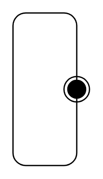

# Submachine State

## Definition

```
{
  _style: { 
    entity: 'shape=mxgraph.sysml.submState;whiteSpace=wrap;align=center;',
  },
  _original_width: 0,
  _original_height: 120,
}
```

## Usage

```
import { SubmachineState } from '@diac/standard-components-diagrams/sysmlStateMachines'

<SubmachineState/>
```

## Preview


