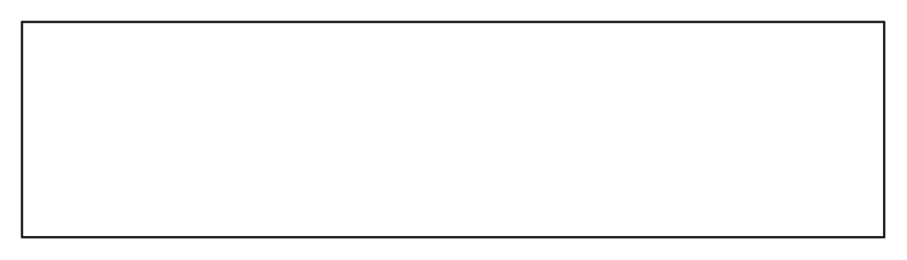

# Stereotype (Compartment)

## Definition

```
{
  _style: { 
    entity: 'shape=rect;html=1;overflow=fill;whiteSpace=wrap;align=center;',
  },
  _original_width: 400,
  _original_height: 100,
}
```

## Usage

```
import { StereotypeCompartment } from '@dinghy/standard-components-diagrams/sysmlStereotypes'

<StereotypeCompartment/>
```

## Preview


