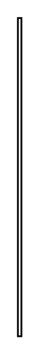

# Stereotype (Edge)

## Definition

```
{
  _style: { 
    entity: 'endArrow=none;html=1;edgeStyle=none;labelBackgroundColor=none;align=left;fontStyle=1;fontSize=10;',
  },
  _width: 2,
  _height: 180,
}
```

## Usage

```
import { StereotypeEdge } from '@diac/standard-components-diagrams/sysmlStereotypes'

<StereotypeEdge/>
```

## Preview


