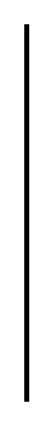

# Stereotype Note 2

## Definition

```
{
  _style: 'shape=rect;fontStyle=1;html=1;whiteSpace=wrap;align=center;',
  _width: 1,
  _height: 150,
}
```

## Usage

```
import { StereotypeNote2 } from '@reactiac/standard-components-diagrams/sysmlStereotypes'

<StereotypeNote2/>
```

## Preview


