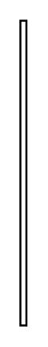

# Stereotype Note 3

## Definition

```
{
  _style: { 
    entity: 'rounded=0;labelBackgroundColor=none;verticalAlign=top;endArrow=none;fontStyle=1;html=1;',
  },
  _original_width: 3,
  _original_height: 150,
}
```

## Usage

```
import { StereotypeNote3 } from '@dinghy/standard-components-diagrams/sysmlStereotypes'

<StereotypeNote3/>
```

## Preview


