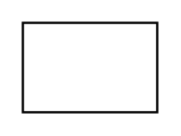

# Actor 2

## Definition

```
{
  _style: 'fontStyle=1;align=center;verticalAlign=middle;childLayout=stackLayout;horizontal=1;horizontalStack=0;resizeParent=1;resizeParentMax=0;resizeLast=0;marginBottom=0;',
  _width: 0,
  _height: 40,
}
```

## Usage

```
import { Actor2 } from '@diac/standard-components-diagrams/sysmlUsecases'

<Actor2/>
```

## Preview


