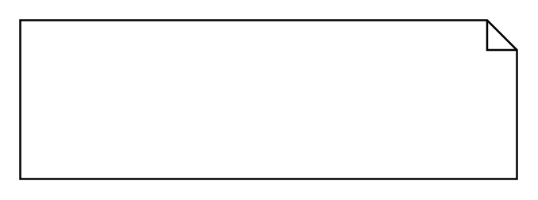

# Extend with Condition

## Definition

```
{
  _style: 'shape=note;size=15;spacingLeft=5;align=left;whiteSpace=wrap;',
  _width: 250,
  _height: 80,
}
```

## Usage

```
import { ExtendWithCondition } from '@diac/standard-components-diagrams/sysmlUsecases'

<ExtendWithCondition/>
```

## Preview


