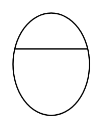

# Use Case 2

## Definition

```
{
  _style: 'html=1;shape=mxgraph.sysml.useCaseExtPt;whiteSpace=wrap;align=center;',
  _width: 0,
  _height: 80,
}
```

## Usage

```
import { UseCase2 } from '@diac/standard-components-diagrams/sysmlUsecases'

<UseCase2/>
```

## Preview


