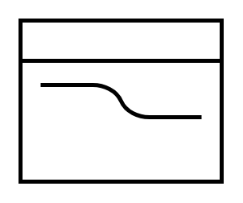

# Cross-Dock

## Definition

```
{
  _style: 'verticalLabelPosition=bottom;html=1;verticalAlign=top;strokeWidth=2;shape=mxgraph.lean_mapping.crossDock;',
  _width: 100,
  _height: 80,
}
```

## Usage

```
import { CrossDock } from '@diac/standard-components-diagrams/valueStreamMapping'

<CrossDock/>
```

## Preview


