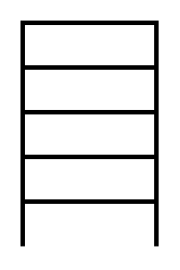

# Data Box

## Definition

```
{
  _style: { 
    entity: 'strokeWidth=2;html=1;shape=mxgraph.lean_mapping.data_box;html=1;',
  },
  _original_width: 60,
  _original_height: 100,
}
```

## Usage

```
import { DataBox } from '@dinghy/standard-components-diagrams/valueStreamMapping'

<DataBox/>
```

## Preview


