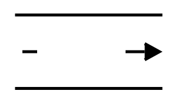

# FIFO Sequence

## Definition

```
{
  _style: { 
    entity: 'strokeWidth=2;html=1;shape=mxgraph.lean_mapping.fifo_sequence_flow;pointerEvents=1;fontStyle=0;fontSize=20;align=center;',
  },
  _width: 100,
  _height: 50,
}
```

## Usage

```
import { FifoSequence } from '@diac/standard-components-diagrams/valueStreamMapping'

<FifoSequence/>
```

## Preview


