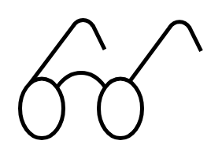

# Go See Production Scheduling

## Definition

```
{
  _style: 'verticalLabelPosition=bottom;html=1;verticalAlign=top;strokeWidth=2;shape=mxgraph.lean_mapping.go_see_production_scheduling;pointerEvents=1;',
  _width: 92,
  _height: 60,
}
```

## Usage

```
import { GoSeeProductionScheduling } from '@diac/standard-components-diagrams/valueStreamMapping'

<GoSeeProductionScheduling/>
```

## Preview


