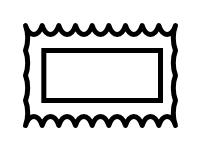

# Kaizen Lightening Burst

## Definition

```
{
  _style: 'verticalLabelPosition=bottom;html=1;verticalAlign=top;strokeWidth=2;shape=mxgraph.lean_mapping.kaizen_lightening_burst;',
  _width: 0,
  _height: 40,
}
```

## Usage

```
import { KaizenLighteningBurst } from '@reactiac/standard-components-diagrams/valueStreamMapping'

<KaizenLighteningBurst/>
```

## Preview


