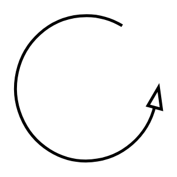

# Material Pull

## Definition

```
{
  _style: { 
    entity: 'verticalLabelPosition=bottom;html=1;verticalAlign=top;strokeWidth=2;shape=mxgraph.lean_mapping.physical_pull;pointerEvents=1;',
  },
  _width: 60,
  _height: 60,
}
```

## Usage

```
import { MaterialPull } from '@diac/standard-components-diagrams/valueStreamMapping'

<MaterialPull/>
```

## Preview


