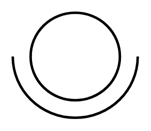

# Operator

## Definition

```
{
  _style: { 
    entity: 'verticalLabelPosition=bottom;html=1;verticalAlign=top;strokeWidth=2;shape=mxgraph.lean_mapping.operator;',
  },
  _original_width: 100,
  _original_height: 84,
}
```

## Usage

```
import { Operator } from '@dinghy/standard-components-diagrams/valueStreamMapping'

<Operator/>
```

## Preview


