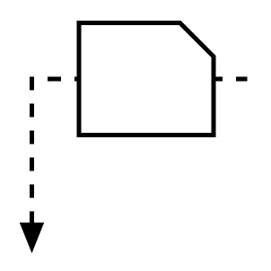

# Production Kanban

## Definition

```
{
  _style: 'strokeWidth=2;html=1;shape=mxgraph.lean_mapping.production_kanban;overflow=fill;',
  _width: 60,
  _height: 60,
}
```

## Usage

```
import { ProductionKanban } from '@diac/standard-components-diagrams/valueStreamMapping'

<ProductionKanban/>
```

## Preview


