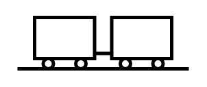

# Rail Shipment

## Definition

```
{
  _style: { 
    entity: 'verticalLabelPosition=bottom;html=1;verticalAlign=top;strokeWidth=2;shape=mxgraph.lean_mapping.rail_shipment;',
  },
  _original_width: 100,
  _original_height: 30,
}
```

## Usage

```
import { RailShipment } from '@diac/standard-components-diagrams/valueStreamMapping'

<RailShipment/>
```

## Preview


