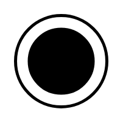

# Sequenced Pull Ball

## Definition

```
{
  _style: 'verticalLabelPosition=bottom;html=1;verticalAlign=top;strokeWidth=2;shape=mxgraph.lean_mapping.sequenced_pull_ball;',
  _width: 60,
  _height: 60,
}
```

## Usage

```
import { SequencedPullBall } from '@diac/standard-components-diagrams/valueStreamMapping'

<SequencedPullBall/>
```

## Preview


