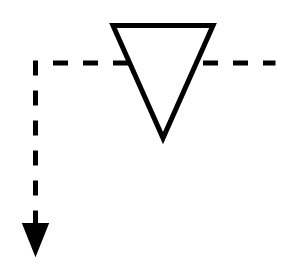

# Signal Kanban

## Definition

```
{
  _style: { 
    entity: 'strokeWidth=2;html=1;shape=mxgraph.lean_mapping.signal_kanban;overflow=fill;',
  },
  _width: 100,
  _height: 90,
}
```

## Usage

```
import { SignalKanban } from '@diac/standard-components-diagrams/valueStreamMapping'

<SignalKanban/>
```

## Preview


