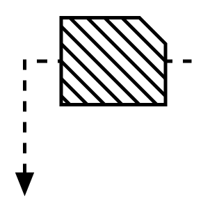

# Withdrawal Kanban

## Definition

```
{
  _style: 'strokeWidth=2;html=1;shape=mxgraph.lean_mapping.withdrawal_kanban;overflow=fill;',
  _width: 100,
  _height: 100,
}
```

## Usage

```
import { WithdrawalKanban } from '@reactiac/standard-components-diagrams/valueStreamMapping'

<WithdrawalKanban/>
```

## Preview


