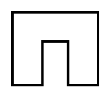

# Workcell

## Definition

```
{
  _style: 'verticalLabelPosition=bottom;html=1;verticalAlign=top;strokeWidth=2;shape=mxgraph.lean_mapping.work_cell;pointerEvents=1;',
  _width: 70,
  _height: 60,
}
```

## Usage

```
import { Workcell } from '@reactiac/standard-components-diagrams/valueStreamMapping'

<Workcell/>
```

## Preview


