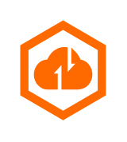

# CSAS Cloud Security Access Service

## Definition

```
{
  _style: 'points=[];aspect=fixed;html=1;align=center;shadow=0;dashed=0;fillColor=#FF6A00;strokeColor=none;shape=mxgraph.alibaba_cloud.csas_cloud_security_access_service;',
  _width: 43.199999999999996,
  _height: 50.099999999999994,
}
```

## Usage

```
import { CsasCloudSecurityAccessService } from '@reactiac/standard-components-diagrams/alibabaCloud'

<CsasCloudSecurityAccessService/>
```

## Preview


