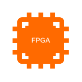

# FPGA Field Programmable Gate Array

## Definition

```
{
  _style: { 
    entity: 'points=[];aspect=fixed;html=1;align=center;shadow=0;dashed=0;fillColor=#FF6A00;strokeColor=none;shape=mxgraph.alibaba_cloud.fpga_field_programmable_gate_array;',
  },
  _original_width: 45.6,
  _original_height: 45.3,
}
```

## Usage

```
import { FpgaFieldProgrammableGateArray } from '@diac/standard-components-diagrams/alibabaCloud'

<FpgaFieldProgrammableGateArray/>
```

## Preview


