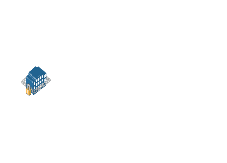

# Secure Building

## Definition

```
{
  _style: { 
    entity: 'image;points=[];aspect=fixed;html=1;align=center;shadow=0;dashed=0;image=img/lib/allied_telesis/buildings/Secure_Building.svg;strokeColor=none;',
  },
  _width: 163.20000000000002,
  _height: 111.60000000000001,
}
```

## Usage

```
import { SecureBuilding } from '@diac/standard-components-diagrams/alliedTelesisBuildings'

<SecureBuilding/>
```

## Preview


