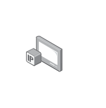

# IP TV

## Definition

```
{
  _style: { 
    entity: 'image;points=[];aspect=fixed;html=1;align=center;shadow=0;dashed=0;image=img/lib/allied_telesis/computer_and_terminals/IP_TV.svg;strokeColor=none;',
  },
  _original_width: 49.199999999999996,
  _original_height: 50.4,
}
```

## Usage

```
import { IpTv } from '@dinghy/standard-components-diagrams/alliedTelesisComputerAndTerminals'

<IpTv/>
```

## Preview


