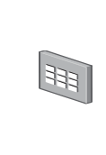

# Keypad

## Definition

```
{
  _style: 'image;points=[];aspect=fixed;html=1;align=center;shadow=0;dashed=0;image=img/lib/allied_telesis/computer_and_terminals/Keypad.svg;strokeColor=none;',
  _width: 26.4,
  _height: 48,
}
```

## Usage

```
import { Keypad } from '@reactiac/standard-components-diagrams/alliedTelesisComputerAndTerminals'

<Keypad/>
```

## Preview


