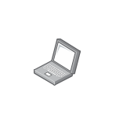

# Laptop

## Definition

```
{
  _style: { 
    entity: 'image;points=[];aspect=fixed;html=1;align=center;shadow=0;dashed=0;image=img/lib/allied_telesis/computer_and_terminals/Laptop.svg;strokeColor=none;',
  },
  _original_width: 42,
  _original_height: 42.599999999999994,
}
```

## Usage

```
import { Laptop } from '@dinghy/standard-components-diagrams/alliedTelesisComputerAndTerminals'

<Laptop/>
```

## Preview


