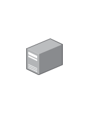

# Server Desktop

## Definition

```
{
  _style: { 
    entity: 'image;points=[];aspect=fixed;html=1;align=center;shadow=0;dashed=0;image=img/lib/allied_telesis/computer_and_terminals/Server_Desktop.svg;strokeColor=none;',
  },
  _width: 42.599999999999994,
  _height: 54,
}
```

## Usage

```
import { ServerDesktop } from '@diac/standard-components-diagrams/alliedTelesisComputerAndTerminals'

<ServerDesktop/>
```

## Preview


