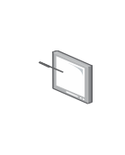

# Tablet Alternative

## Definition

```
{
  _style: { 
    entity: 'image;points=[];aspect=fixed;html=1;align=center;shadow=0;dashed=0;image=img/lib/allied_telesis/computer_and_terminals/Tablet_Alternative.svg;strokeColor=none;',
  },
  _original_width: 34.8,
  _original_height: 48,
}
```

## Usage

```
import { TabletAlternative } from '@dinghy/standard-components-diagrams/alliedTelesisComputerAndTerminals'

<TabletAlternative/>
```

## Preview


