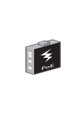

# Industrial Media Converter POE

## Definition

```
{
  _style: { 
    entity: 'image;points=[];aspect=fixed;html=1;align=center;shadow=0;dashed=0;image=img/lib/allied_telesis/media_converters/Industrial_Media_Converter_POE.svg;strokeColor=none;',
  },
  _original_width: 30,
  _original_height: 57,
}
```

## Usage

```
import { IndustrialMediaConverterPoe } from '@dinghy/standard-components-diagrams/alliedTelesisMediaConverters'

<IndustrialMediaConverterPoe/>
```

## Preview


