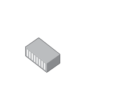

# Media Converter Modular

## Definition

```
{
  _style: 'image;points=[];aspect=fixed;html=1;align=center;shadow=0;dashed=0;image=img/lib/allied_telesis/media_converters/Media_Converter_Modular.svg;strokeColor=none;',
  _width: 70.8,
  _height: 54.6,
}
```

## Usage

```
import { MediaConverterModular } from '@reactiac/standard-components-diagrams/alliedTelesisMediaConverters'

<MediaConverterModular/>
```

## Preview


