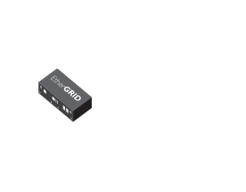

# EtherGRID

## Definition

```
{
  _style: { 
    entity: 'image;points=[];aspect=fixed;html=1;align=center;shadow=0;dashed=0;image=img/lib/allied_telesis/security/EtherGRID.svg;strokeColor=none;',
  },
  _original_width: 89.4,
  _original_height: 64.80000000000001,
}
```

## Usage

```
import { Ethergrid } from '@dinghy/standard-components-diagrams/alliedTelesisSecurity'

<Ethergrid/>
```

## Preview


