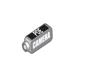

# POE DVS Camera

## Definition

```
{
  _style: 'image;points=[];aspect=fixed;html=1;align=center;shadow=0;dashed=0;image=img/lib/allied_telesis/security/POE_DVS_Camera.svg;strokeColor=none;',
  _width: 51,
  _height: 40.2,
}
```

## Usage

```
import { PoeDvsCamera } from '@diac/standard-components-diagrams/alliedTelesisSecurity'

<PoeDvsCamera/>
```

## Preview


