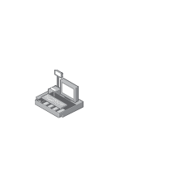

# POS

## Definition

```
{
  _style: { 
    entity: 'image;points=[];aspect=fixed;html=1;align=center;shadow=0;dashed=0;image=img/lib/allied_telesis/security/POS.svg;strokeColor=none;',
  },
  _width: 67.8,
  _height: 72,
}
```

## Usage

```
import { Pos } from '@diac/standard-components-diagrams/alliedTelesisSecurity'

<Pos/>
```

## Preview


