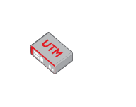

# Router UTM

## Definition

```
{
  _style: 'image;points=[];aspect=fixed;html=1;align=center;shadow=0;dashed=0;image=img/lib/allied_telesis/security/Router_UTM.svg;strokeColor=none;',
  _width: 55.800000000000004,
  _height: 39.6,
}
```

## Usage

```
import { RouterUtm } from '@diac/standard-components-diagrams/alliedTelesisSecurity'

<RouterUtm/>
```

## Preview


