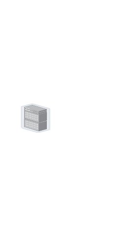

# Datacenter Server Rack EoR

## Definition

```
{
  _style: { 
    entity: 'image;points=[];aspect=fixed;html=1;align=center;shadow=0;dashed=0;image=img/lib/allied_telesis/storage/Datacenter_Server_Rack_EoR.svg;strokeColor=none;',
  },
  _original_width: 85.8,
  _original_height: 173.4,
}
```

## Usage

```
import { DatacenterServerRackEor } from '@dinghy/standard-components-diagrams/alliedTelesisStorage'

<DatacenterServerRackEor/>
```

## Preview


