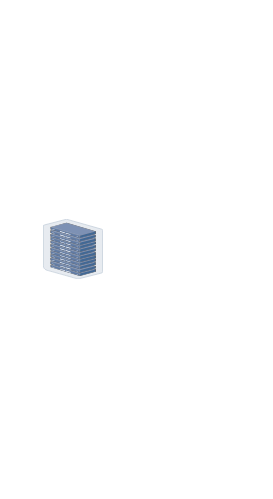

# Datacenter Server Rack

## Definition

```
{
  _style: { 
    entity: 'image;points=[];aspect=fixed;html=1;align=center;shadow=0;dashed=0;image=img/lib/allied_telesis/storage/Datacenter_Server_Rack.svg;strokeColor=none;',
  },
  _original_width: 88.2,
  _original_height: 178.8,
}
```

## Usage

```
import { DatacenterServerRack } from '@diac/standard-components-diagrams/alliedTelesisStorage'

<DatacenterServerRack/>
```

## Preview


