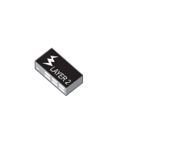
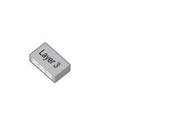
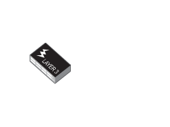

# Allied Telesis Switch Entities

- [IndustrialEthernetIe200](./industrial-ethernet-ie200.md)  

- [IndustrialEthernetIe200Poe](./industrial-ethernet-ie200-poe.md)  

- [IndustrialEthernetIe300](./industrial-ethernet-ie300.md)  

- [ModularSwitchSbx8106](./modular-switch-sbx8106.md)  

- [ModularSwitchSbx8112](./modular-switch-sbx8112.md)  

- [ModularSwitchSxx908gen2](./modular-switch-sxx908gen2.md)  

- [Switch24PortL2](./switch-24-port-l2.md)  

- [Switch24PortL2Poe](./switch-24-port-l2-poe.md)  

- [Switch24PortL3](./switch-24-port-l3.md)  

- [Switch24PortL3Alternative](./switch-24-port-l3-alternative.md)  

- [Switch24PortL3Poe](./switch-24-port-l3-poe.md)  

- [Switch48PortL2](./switch-48-port-l2.md)  

- [Switch48PortL2Poe](./switch-48-port-l2-poe.md)  

- [Switch48PortL3](./switch-48-port-l3.md)  

- [Switch48PortL3Poe](./switch-48-port-l3-poe.md)  

- [Switch52PortL3](./switch-52-port-l3.md)  

