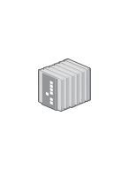

# Industrial Ethernet IE200

## Definition

```
{
  _style: { 
    entity: 'image;points=[];aspect=fixed;html=1;align=center;shadow=0;dashed=0;image=img/lib/allied_telesis/switch/Industrial_Ethernet_IE200.svg;strokeColor=none;',
  },
  _original_width: 40.2,
  _original_height: 56.4,
}
```

## Usage

```
import { IndustrialEthernetIe200 } from '@diac/standard-components-diagrams/alliedTelesisSwitch'

<IndustrialEthernetIe200/>
```

## Preview


