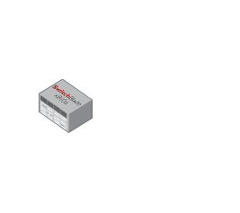

# Modular Switch SBx8106

## Definition

```
{
  _style: 'image;points=[];aspect=fixed;html=1;align=center;shadow=0;dashed=0;image=img/lib/allied_telesis/switch/Modular_Switch_SBx8106.svg;strokeColor=none;',
  _width: 85.8,
  _height: 73.8,
}
```

## Usage

```
import { ModularSwitchSbx8106 } from '@diac/standard-components-diagrams/alliedTelesisSwitch'

<ModularSwitchSbx8106/>
```

## Preview


