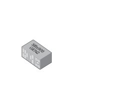

# Modular Switch SXx908GEN2

## Definition

```
{
  _style: { 
    entity: 'image;points=[];aspect=fixed;html=1;align=center;shadow=0;dashed=0;image=img/lib/allied_telesis/switch/Modular_Switch_SXx908GEN2.svg;strokeColor=none;',
  },
  _original_width: 78,
  _original_height: 66.60000000000001,
}
```

## Usage

```
import { ModularSwitchSxx908gen2 } from '@diac/standard-components-diagrams/alliedTelesisSwitch'

<ModularSwitchSxx908gen2/>
```

## Preview


