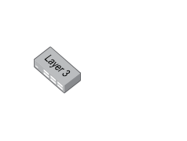

# Switch 24 port L3

## Definition

```
{
  _style: { 
    entity: 'image;points=[];aspect=fixed;html=1;align=center;shadow=0;dashed=0;image=img/lib/allied_telesis/switch/Switch_24_port_L3.svg;strokeColor=none;',
  },
  _original_width: 74.4,
  _original_height: 51,
}
```

## Usage

```
import { Switch24PortL3 } from '@diac/standard-components-diagrams/alliedTelesisSwitch'

<Switch24PortL3/>
```

## Preview


