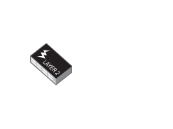

# Switch 48 port L2 POE

## Definition

```
{
  _style: { 
    entity: 'image;points=[];aspect=fixed;html=1;align=center;shadow=0;dashed=0;image=img/lib/allied_telesis/switch/Switch_48_port_L2_POE.svg;strokeColor=none;',
  },
  _original_width: 78,
  _original_height: 52.8,
}
```

## Usage

```
import { Switch48PortL2Poe } from '@diac/standard-components-diagrams/alliedTelesisSwitch'

<Switch48PortL2Poe/>
```

## Preview


