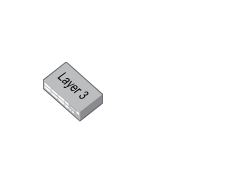

# Switch 52 port L3

## Definition

```
{
  _style: 'image;points=[];aspect=fixed;html=1;align=center;shadow=0;dashed=0;image=img/lib/allied_telesis/switch/Switch_52_port_L3.svg;strokeColor=none;',
  _width: 78,
  _height: 52.8,
}
```

## Usage

```
import { Switch52PortL3 } from '@diac/standard-components-diagrams/alliedTelesisSwitch'

<Switch52PortL3/>
```

## Preview


