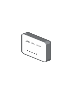

# Access Point Indoor

## Definition

```
{
  _style: { 
    entity: 'image;points=[];aspect=fixed;html=1;align=center;shadow=0;dashed=0;image=img/lib/allied_telesis/wireless/Access_Point_Indoor.svg;strokeColor=none;',
  },
  _original_width: 36.6,
  _original_height: 54.6,
}
```

## Usage

```
import { AccessPointIndoor } from '@dinghy/standard-components-diagrams/alliedTelesisWireless'

<AccessPointIndoor/>
```

## Preview


