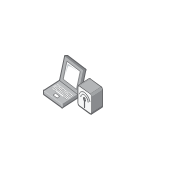

# Laptop Wireless

## Definition

```
{
  _style: { 
    entity: 'image;points=[];aspect=fixed;html=1;align=center;shadow=0;dashed=0;image=img/lib/allied_telesis/wireless/Laptop_Wireless.svg;strokeColor=none;',
  },
  _width: 57.599999999999994,
  _height: 47.400000000000006,
}
```

## Usage

```
import { LaptopWireless } from '@diac/standard-components-diagrams/alliedTelesisWireless'

<LaptopWireless/>
```

## Preview


