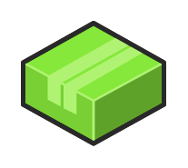

# Application 2

## Definition

```
{
  _style: 'verticalLabelPosition=bottom;html=1;verticalAlign=top;strokeWidth=1;align=center;outlineConnect=0;dashed=0;outlineConnect=0;shape=mxgraph.aws3d.application2;fillColor=#86E83A;strokeColor=#B0F373;aspect=fixed;',
  _width: 62,
  _height: 53,
}
```

## Usage

```
import { Application2 } from '@reactiac/standard-components-diagrams/aws3d'

<Application2/>
```

## Preview


