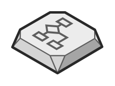

# Decider

## Definition

```
{
  _style: { 
    entity: 'verticalLabelPosition=bottom;html=1;verticalAlign=top;strokeWidth=1;align=center;outlineConnect=0;dashed=0;outlineConnect=0;shape=mxgraph.aws3d.decider;fillColor=#ECECEC;strokeColor=#5E5E5E;aspect=fixed;',
  },
  _original_width: 74,
  _original_height: 50,
}
```

## Usage

```
import { Decider } from '@diac/standard-components-diagrams/aws3d'

<Decider/>
```

## Preview


