# Aws 3D Entities

- [Ami](./ami.md)  
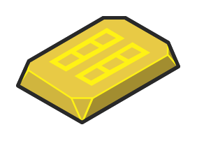

- [Ami2](./ami-2.md)  

- [Application](./application.md)  

- [Application2](./application-2.md)  

- [ArrowNe](./arrow-ne.md)  

- [ArrowNw](./arrow-nw.md)  

- [ArrowSe](./arrow-se.md)  

- [ArrowSw](./arrow-sw.md)  
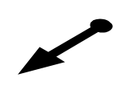

- [Arrowhead](./arrowhead.md)  

- [ArrowlessNe](./arrowless-ne.md)  
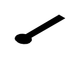

- [Client](./client.md)  

- [Cloudfront](./cloudfront.md)  
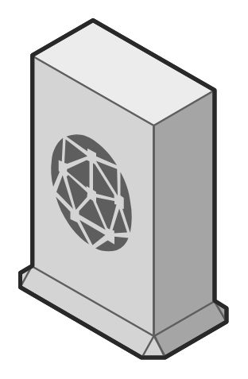

- [Content](./content.md)  

- [CustomerGateway](./customer-gateway.md)  
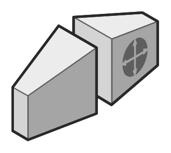

- [DashedArrowlessEdge](./dashed-arrowless-edge.md)  

- [DashedEdge](./dashed-edge.md)  

- [DashedEdgeDoubleArrow](./dashed-edge-double-arrow.md)  

- [DataCenter](./data-center.md)  

- [DataServer](./data-server.md)  
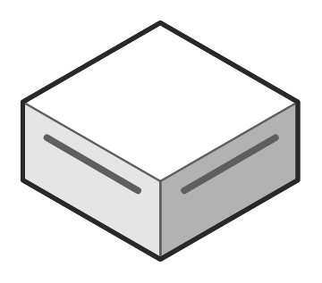

- [Decider](./decider.md)  

- [Dynamodb](./dynamodb.md)  
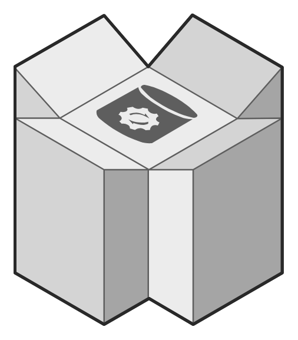

- [Ebs](./ebs.md)  

- [Ebs2](./ebs-2.md)  
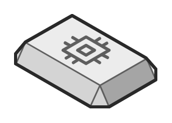

- [Ec2Instance](./ec2-instance.md)  
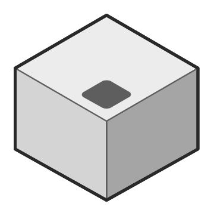

- [Edge](./edge.md)  
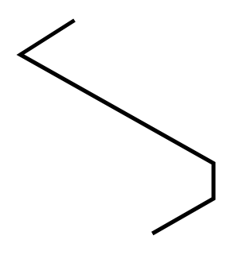

- [ElasticBeanstalk](./elastic-beanstalk.md)  
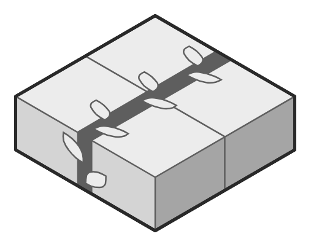

- [ElasticLoadBalancing](./elastic-load-balancing.md)  

- [ElasticMapreduce](./elastic-mapreduce.md)  
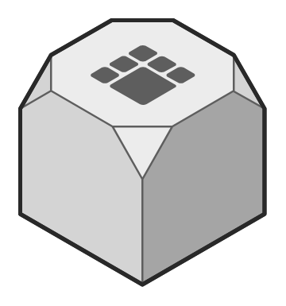

- [Email](./email.md)  

- [EmailService](./email-service.md)  
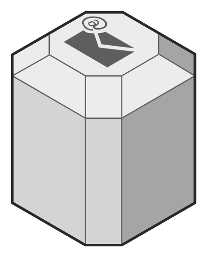

- [File](./file.md)  
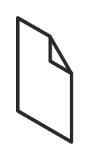

- [FlatDoubleEdge](./flat-double-edge.md)  

- [FlatEdge](./flat-edge.md)  

- [Glacier](./glacier.md)  

- [ImageVideo](./image-video.md)  

- [InternetGateway](./internet-gateway.md)  

- [Lambda](./lambda.md)  
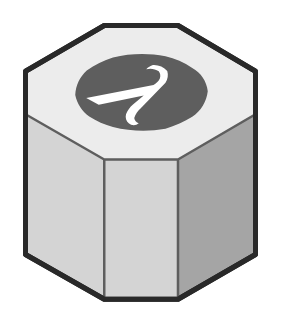

- [MobileWorker](./mobile-worker.md)  

- [OracleDataCenter](./oracle-data-center.md)  
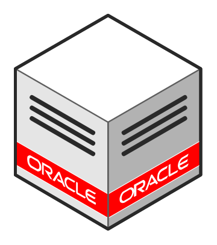

- [OracleDatabaseServer](./oracle-database-server.md)  
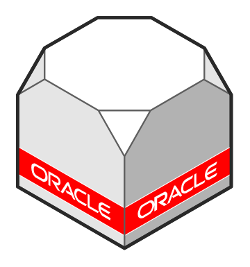

- [OracleServer](./oracle-server.md)  
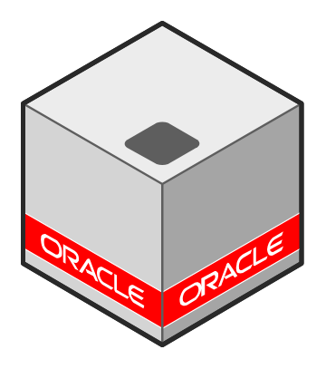

- [Rds](./rds.md)  
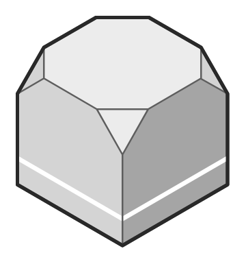

- [RdsMaster](./rds-master.md)  
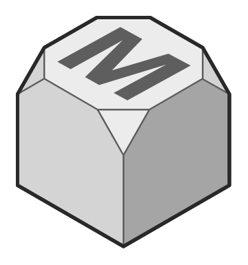

- [RdsSlave](./rds-slave.md)  

- [Redshift](./redshift.md)  

- [Reference](./reference.md)  

- [Route53](./route-53.md)  
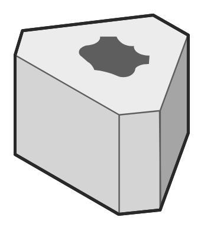

- [S3](./s3.md)  

- [S3Bucket](./s3-bucket.md)  
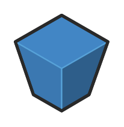

- [SearchEngine](./search-engine.md)  
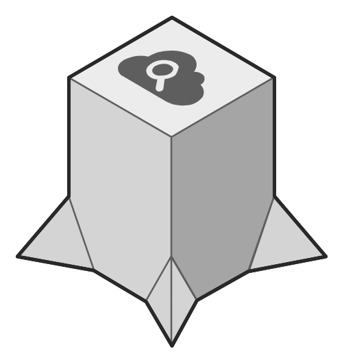

- [SecureConnection](./secure-connection.md)  

- [SecurityTokenService](./security-token-service.md)  

- [Simpledb](./simpledb.md)  
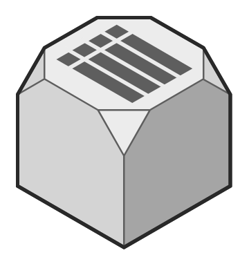

- [Simpledb2](./simpledb-2.md)  

- [Snapshot](./snapshot.md)  
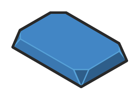

- [Spot](./spot.md)  

- [SpotInstance](./spot-instance.md)  
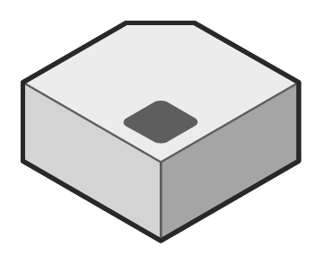

- [Sqs](./sqs.md)  
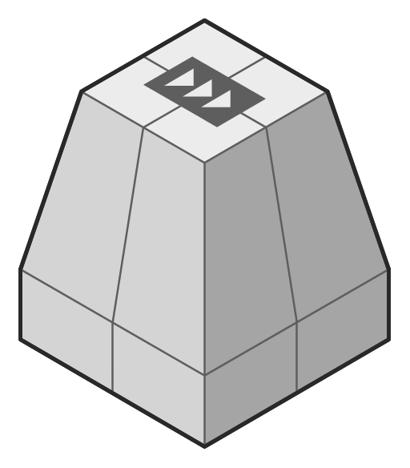

- [User](./user.md)  

- [VpcGateway](./vpc-gateway.md)  
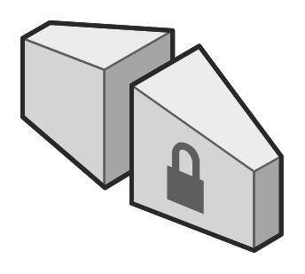

- [Worker](./worker.md)  
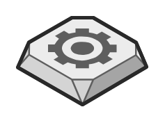

- [WorkflowService](./workflow-service.md)  

