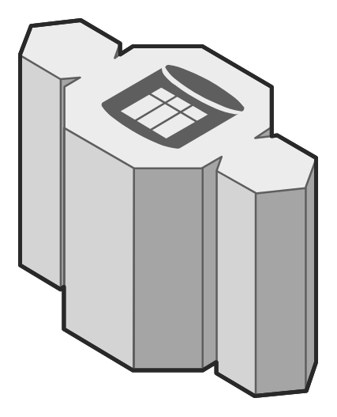

# Redshift

## Definition

```
{
  _style: 'verticalLabelPosition=bottom;html=1;verticalAlign=top;strokeWidth=1;align=center;outlineConnect=0;dashed=0;outlineConnect=0;shape=mxgraph.aws3d.redshift;fillColor=#ECECEC;strokeColor=#5E5E5E;aspect=fixed;',
  _width: 150,
  _height: 190,
}
```

## Usage

```
import { Redshift } from '@reactiac/standard-components-diagrams/aws3d'

<Redshift/>
```

## Preview


